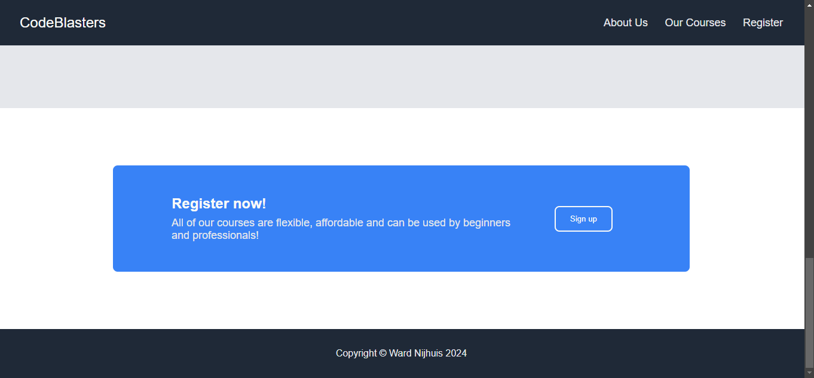

# Landing Page

## Description

A landing page for a fictive company that makes web development courses for beginners and professionals. It includes a navbar/header, a hero with information about the company, a list of courses, a testimonial, a sign up/register button and a copyright footer. Because this is a artificial company, the content on the page is not applicable to any particular company.

The landing page is made using only vanilla HTML and CSS. Flexbox is used for the fomatting and positioning of elements within the page and the hover effects on the buttons and links are done with pseudo-selectors.

During the project I had difficulty with getting the spacing between sections and elements right using flexbox, margin and padding. I also had problems with using the right colors and styles for text and background elements, even though most of them were already outlined in [the description of the exercise](https://www.theodinproject.com/lessons/foundations-landing-page).

In the future I would like to add more animations/effects to the website, as well as some minor fixes  to alignment and positioning. I would also like to make my own icons for the courses section, rather than using those of [freeCodeCamp](https://www.freecodecamp.org/learn/). If I have the time, motivation and determination I might want to add actual courses to the landing page, but this would be very time consuming and I am probably not the best fit for making a web development course.

## Usage

You can visit the website [here](https://wardnijhuis.github.io/landing_page/). The user can use the navbar or scroll to visit the sections of the webpage. The signup buttons don't do anything, even though they do make the cursor a pointer.

## Credits

Hero image: [WallpaperAccess](https://wallpaperaccess.com/web-developer)
Courses icons: [freeCodeCamp](https://www.freecodecamp.org/)

## License

[MIT](https://github.com/wardnijhuis/landing_page/blob/main/LICENSE)
